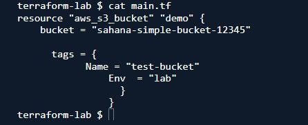
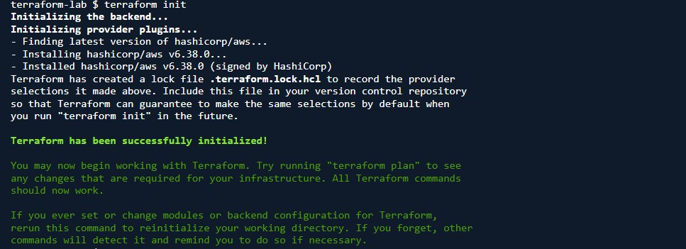
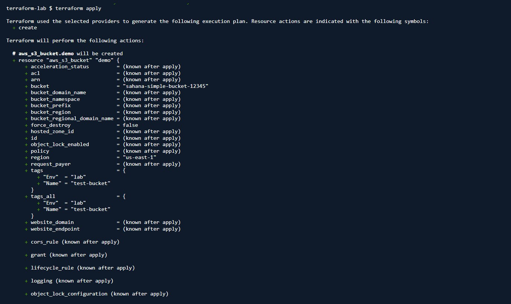
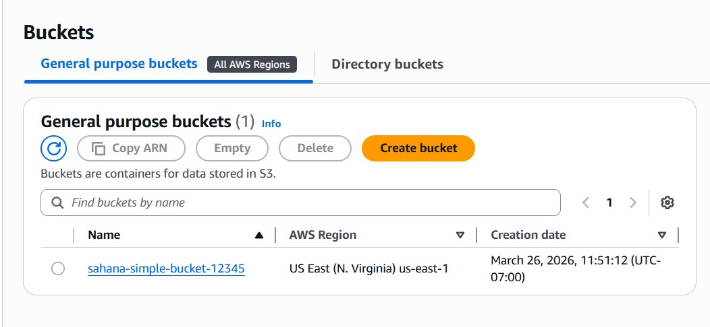
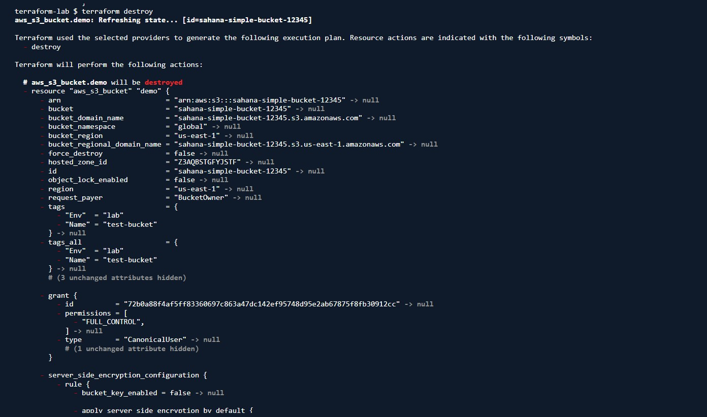

# Terraform S3 Bucket Lab — Runbook

**Scope:** Provision and destroy an AWS S3 bucket using Terraform  
**Environment:** AWS CloudShell lab  
**Author:** Sahana  
**Last updated:** 2026-03-26

---

## What is Terraform

Terraform is an Infrastructure as Code tool used to define and manage cloud resources through configuration files. Instead of creating resources manually in the AWS console, you declare the desired state in code and Terraform creates, updates, or destroys the resources to match that state.

---

## Before you touch anything

1. Verify Terraform is installed before creating any files
2. Use a globally unique S3 bucket name — bucket names are shared across AWS
3. Always destroy the resource after the lab to avoid leaving unused infrastructure behind

---

## Execution steps

### Step 1 — Verify Terraform is installed

```bash
terraform -version
```

You should see Terraform return a version number. If the command is not found, install Terraform first before continuing.

---

### Step 2 — Create the working folder

```bash
mkdir simple-tf
cd simple-tf
```

This keeps the lab isolated in one directory.

---

### Step 3 — Create the Terraform file

```bash
nano main.tf
```

Paste the following configuration:

```hcl
provider "aws" {
  region = "us-east-1"
}

resource "aws_s3_bucket" "demo" {
  bucket = "sahana-simple-bucket-12345"

  tags = {
    Name = "terraform-lab"
    Env  = "test"
  }
}
```

Save and exit the editor.

---

### Step 4 — Initialize Terraform

```bash
terraform init
```

This downloads the required provider plugins and initializes the working directory. After this step Terraform creates the `.terraform` folder and lock file.

---

### Step 5 — Format the configuration

```bash
terraform fmt
```

This rewrites the file into standard Terraform formatting. It is optional for the lab but good practice.

---

### Step 6 — Validate the configuration

```bash
terraform validate
```

This checks the syntax and confirms the configuration is structurally valid before any resource is created.

Expected output:

```text
Success! The configuration is valid.
```

---

### Step 7 — Review the execution plan

```bash
terraform plan
```

This shows what Terraform is about to create without making changes yet. For this lab you should see Terraform planning to add one S3 bucket resource.

Read the action line carefully:

```text
Plan: 1 to add, 0 to change, 0 to destroy.
```

---

### Step 8 — Apply the configuration

```bash
terraform apply
```

Terraform will display the execution plan again and ask for approval.

Type:

```text
yes
```

Terraform will then create the S3 bucket.

Expected result:

```text
Apply complete! Resources: 1 added, 0 changed, 0 destroyed.
```

---

### Step 9 — Verify the resource in AWS

Open the AWS Console, go to S3, and confirm the bucket was created.

You can also inspect local Terraform state files in the lab directory:

```bash
ls -la
```

You should see files such as:

```text
main.tf
terraform.tfstate
terraform.tfstate.backup
.terraform.lock.hcl
```

`terraform.tfstate` is the local state file that tracks the created resource.

---

### Step 10 — Destroy the resource

```bash
terraform destroy
```

Terraform will show a destroy plan and ask for approval.

Type:

```text
yes
```

Expected result:

```text
Destroy complete! Resources: 1 destroyed.
```

This removes the S3 bucket created during the lab.

---

## Fix and verify

Only change the configuration after reading the error carefully.

### If `terraform init` fails
- Check internet access in the shell
- Re-run `terraform init`

### If bucket creation fails with name already exists
Edit `main.tf` and change the bucket name to something unique:

```hcl
bucket = "sahana-simple-bucket-67890"
```

Then run:

```bash
terraform plan
terraform apply
```

### If AWS permissions fail
Review the error message and confirm the AWS identity has permission to create and delete S3 buckets.

### Final verification
After `terraform destroy`, refresh the S3 console and confirm the bucket no longer exists.

---

## Screenshots

### 01 — Terraform configuration file



`main.tf` containing the AWS provider and S3 bucket resource.

---

### 02 — Terraform initialization



`terraform init` downloading the AWS provider and initializing the working directory.

---

### 03 — Terraform apply output



`terraform apply` creating the S3 bucket after approval.

---

### 05 — S3 bucket visible in AWS console



AWS S3 console showing the created bucket.

---

### 06 — Terraform destroy output



`terraform destroy` removing the S3 bucket and cleaning up the lab.

---

## Lab reproduction

```bash
# Verify Terraform
terraform -version

# Create working folder
mkdir simple-tf
cd simple-tf

# Create Terraform file
nano main.tf
```

Paste:

```hcl
provider "aws" {
  region = "us-east-1"
}

resource "aws_s3_bucket" "demo" {
  bucket = "sahana-simple-bucket-12345"

  tags = {
    Name = "terraform-lab"
    Env  = "test"
  }
}
```

Continue:

```bash
# Initialize
terraform init

# Format
terraform fmt

# Validate
terraform validate

# Review plan
terraform plan

# Create resource
terraform apply

# Verify local files
ls -la

# Destroy resource
terraform destroy
```

---
